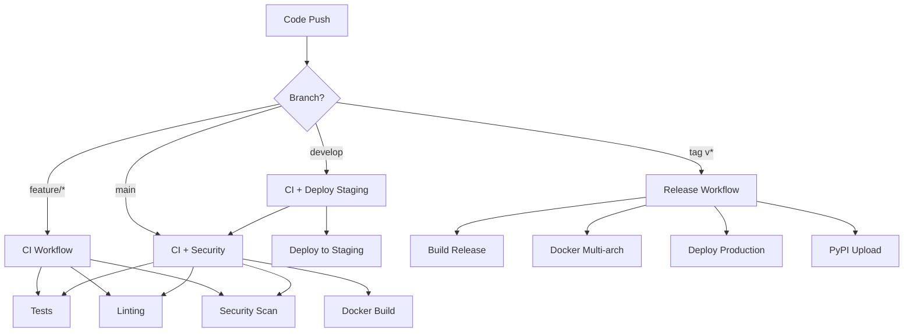

# GitHub Workflows Guide for VisLang-UltraLow-Resource

This guide provides comprehensive documentation for all GitHub workflows used in the VisLang project.

## Overview

The VisLang project uses GitHub Actions for:
- Continuous Integration (CI)
- Continuous Deployment (CD)
- Security scanning
- Performance testing
- Dependency management
- Release automation

## Workflow Architecture



## Workflows

### 1. CI/CD Pipeline (`ci.yml`)

**Trigger**: Push to any branch, Pull requests to main
**Purpose**: Core continuous integration pipeline

**Jobs**:
- **Code Quality Checks**: Linting, formatting, type checking
- **Security Analysis**: Secret scanning, dependency checks, code analysis
- **Test Suite**: Unit, integration, and e2e tests
- **Build and Test Package**: Ensure package builds correctly

**Key Features**:
- Matrix testing across Python versions
- Parallel job execution for speed
- Comprehensive coverage reporting
- Artifact collection for debugging

**Environment Variables**:
```yaml
PYTHON_VERSIONS: ['3.8', '3.9', '3.10', '3.11']
```

### 2. Docker Build (`docker-build.yml`)

**Trigger**: Push to main/develop, tags, PRs, weekly schedule
**Purpose**: Build and push Docker images

**Jobs**:
- **Build**: Multi-stage Docker build with caching
- **Security Scan**: Trivy vulnerability scanning
- **Multi-arch Test**: Test on AMD64 and ARM64
- **Deploy**: Environment-specific deployments

**Key Features**:
- Multi-architecture builds (AMD64, ARM64)
- Layer caching for faster builds
- Security scanning with SARIF upload
- SBOM generation
- Environment-specific deployments

### 3. Security Scanning (`security.yml`)

**Trigger**: Push to main, PRs, schedule, manual
**Purpose**: Comprehensive security analysis

**Jobs**:
- **Dependency Check**: Known vulnerabilities in dependencies
- **Code Analysis**: Static analysis with CodeQL
- **Secret Scanning**: Detect exposed secrets
- **License Compliance**: License compatibility checks
- **Container Security**: Docker image vulnerabilities

**Key Features**:
- Multiple security tools integration
- SARIF report upload to GitHub Security tab
- Automatic issue creation for high-severity findings
- License compliance verification

### 4. Performance Testing (`performance.yml`)

**Trigger**: Push to main, PRs, nightly schedule, manual
**Purpose**: Performance benchmarking and regression detection

**Jobs**:
- **Benchmark Tests**: Performance benchmarks with pytest-benchmark
- **Load Tests**: API load testing with Locust
- **Stress Tests**: System stress testing
- **Memory Profiling**: Memory usage analysis

**Key Features**:
- Benchmark result tracking over time
- Regression detection and alerts
- Multiple test types (load, stress, memory)
- Performance reports in PRs

### 5. Deployment (`deploy.yml`)

**Trigger**: Tags (production), manual dispatch
**Purpose**: Deploy to staging and production environments

**Jobs**:
- **Staging Deploy**: Deploy to staging environment
- **Production Deploy**: Blue-green deployment to production
- **Rollback**: Automatic rollback on failure
- **Notification**: Status notifications

**Key Features**:
- Blue-green deployment strategy
- Pre-deployment backups
- Smoke testing and verification
- Automatic rollback on failure
- Multi-environment support

### 6. Release Management (`release.yml`)

**Trigger**: Tags matching `v*.*.*`
**Purpose**: Automated release process

**Jobs**:
- **Build**: Create distribution packages
- **Test**: Verify release packages
- **Publish**: Upload to PyPI
- **Docker**: Build and push release images
- **GitHub Release**: Create GitHub release with notes

**Key Features**:
- Semantic versioning
- Automated release notes generation
- Multi-format package building
- Digital signing of releases

### 7. Dependency Management (`dependencies.yml`)

**Trigger**: Schedule (daily), manual dispatch
**Purpose**: Automated dependency updates

**Jobs**:
- **Check Updates**: Scan for available updates
- **Create PRs**: Automated dependency update PRs
- **Security Updates**: Priority security patches
- **Compatibility Check**: Test compatibility with updates

**Key Features**:
- Automated Dependabot-like functionality
- Security-first update strategy
- Compatibility testing before merge
- Grouped updates for efficiency

## Configuration Files

### Environment Files

Create environment-specific configuration:

```bash
# Development
.github/environments/development.yml

# Staging  
.github/environments/staging.yml

# Production
.github/environments/production.yml
```

### Secrets Management

#### Repository Secrets
- `CODECOV_TOKEN`: Code coverage reporting
- `PYPI_API_TOKEN`: PyPI package publishing
- `SNYK_TOKEN`: Security vulnerability scanning
- `SLACK_WEBHOOK`: Team notifications

#### Environment Secrets
- `AWS_ACCESS_KEY_ID`: AWS deployment credentials
- `AWS_SECRET_ACCESS_KEY`: AWS deployment credentials
- `KUBECONFIG`: Kubernetes cluster configuration

### Branch Protection Rules

Configure branch protection for `main`:

```yaml
required_status_checks:
  strict: true
  contexts:
    - "Code Quality Checks"
    - "Security Analysis" 
    - "Test Suite"
    - "Build and Test Package"
enforce_admins: true
required_pull_request_reviews:
  required_approving_review_count: 2
  dismiss_stale_reviews: true
  require_code_owner_reviews: true
restrictions:
  users: []
  teams: ["maintainers"]
```

## Workflow Customization

### Adding New Environments

1. Create environment configuration:
```yaml
# .github/environments/new-env.yml
name: new-environment
protection_rules:
  - reviewers:
      - users: ["admin"]
  - wait_timer: 5
environment_variables:
  - name: API_URL
    value: "https://new-env.example.com"
```

2. Add deployment job to `deploy.yml`:
```yaml
deploy-new-env:
  runs-on: ubuntu-latest
  needs: prepare
  if: needs.prepare.outputs.environment == 'new-env'
  environment: new-environment
  steps:
    - name: Deploy to new environment
      run: |
        # Deployment commands here
```

### Custom Test Matrix

Extend test matrix for different configurations:

```yaml
strategy:
  matrix:
    python-version: ['3.8', '3.9', '3.10', '3.11']
    os: [ubuntu-latest, windows-latest, macos-latest]
    extras: ['minimal', 'full', 'ocr', 'training']
  include:
    - python-version: '3.11'
      os: ubuntu-latest
      extras: 'full'
      experimental: true
```

### Adding Security Scans

Add new security tools:

```yaml
- name: Run new security tool
  uses: security-vendor/action@v1
  with:
    token: ${{ secrets.SECURITY_TOKEN }}
    path: ./src
    format: sarif
    output: security-results.sarif
    
- name: Upload security results
  uses: github/codeql-action/upload-sarif@v2
  with:
    sarif_file: security-results.sarif
```

## Monitoring and Debugging

### Workflow Logs

Access workflow logs via:
- GitHub Actions tab in repository
- REST API: `GET /repos/{owner}/{repo}/actions/runs/{run_id}/logs`
- CLI: `gh run view {run_id} --log`

### Common Issues

#### 1. Workflow Permission Errors
```yaml
permissions:
  contents: read
  packages: write
  security-events: write
  actions: read
```

#### 2. Secret Not Found
- Verify secret exists in correct environment
- Check secret name matches workflow reference
- Ensure environment protection rules allow access

#### 3. Docker Build Failures
- Check Dockerfile syntax
- Verify base image availability
- Review build context and .dockerignore

#### 4. Test Failures
- Check test dependencies
- Verify environment setup
- Review test data and fixtures

### Performance Optimization

#### Cache Strategy
```yaml
- name: Cache dependencies
  uses: actions/cache@v3
  with:
    path: ~/.cache/pip
    key: ${{ runner.os }}-pip-${{ hashFiles('**/requirements*.txt') }}
    restore-keys: |
      ${{ runner.os }}-pip-
```

#### Parallel Execution
```yaml
strategy:
  matrix:
    group: [1, 2, 3, 4]
steps:
  - run: pytest --test-group-count 4 --test-group ${{ matrix.group }}
```

## Best Practices

### 1. Security
- Use minimal permissions
- Never commit secrets
- Validate external inputs
- Use signed commits and verified actions

### 2. Performance
- Use caching strategically
- Optimize Docker builds
- Parallelize independent jobs
- Minimize artifact uploads

### 3. Maintainability
- Use reusable workflows
- Document all customizations
- Keep workflows simple and focused
- Regular review and updates

### 4. Monitoring
- Set up workflow failure notifications
- Monitor workflow performance
- Track success rates and timing
- Regular security audits

## Troubleshooting Guide

### Workflow Fails to Trigger
1. Check trigger conditions
2. Verify branch names and patterns
3. Review workflow syntax
4. Check repository permissions

### Jobs Fail Intermittently
1. Review resource limits
2. Check external dependencies
3. Add retry mechanisms
4. Improve error handling

### Security Scans False Positives
1. Review findings carefully
2. Add suppression comments
3. Update security baselines
4. Configure tool-specific ignore rules

### Deployment Issues
1. Verify environment configuration
2. Check deployment credentials
3. Review target environment status
4. Test deployment scripts locally

## Support and Resources

- **GitHub Actions Documentation**: https://docs.github.com/en/actions
- **Workflow Syntax**: https://docs.github.com/en/actions/learn-github-actions/workflow-syntax-for-github-actions
- **Security Best Practices**: https://docs.github.com/en/actions/security-guides
- **Marketplace Actions**: https://github.com/marketplace?type=actions

For project-specific help:
- Create an issue with label `workflow-help`
- Contact the DevOps team
- Review workflow logs and error messages